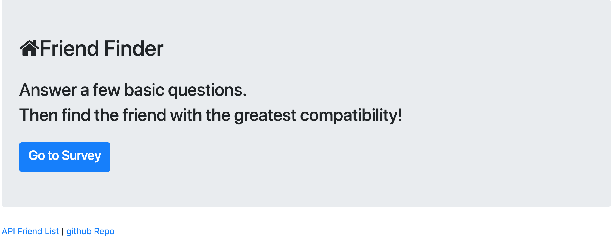
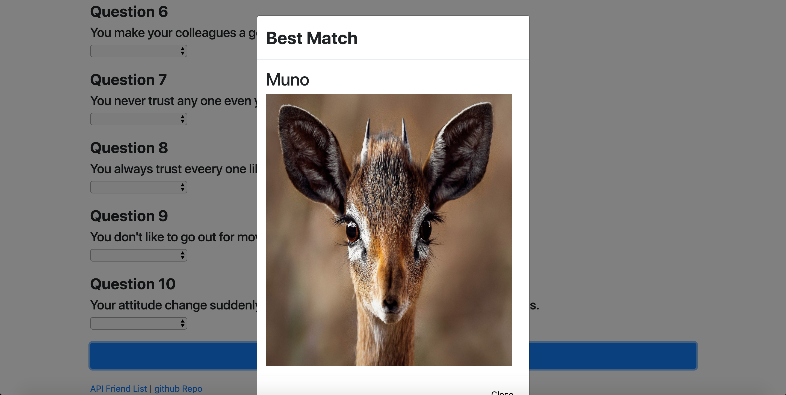

# FriendFinderNodeExpress
Friend Finder working with Node and Express

#### Initial Loading of Friend Finder
Initially displaying "Go To Survey" page along with Frined API and Github repo page

#### Friend Suggestion after completing 10 Questions Survey 
Once user click on "Go To Survey", Survey page will be deployed using NODE JS REST API, here EXPRESS server is being used. User must enter their name and profile pic url before completing survey.

After completing user input, Survey results sent via REST POST Method and express server computes the results base on stored data.

Once computed best match data sent to Front End and displayed using Boot Strap Modal.
